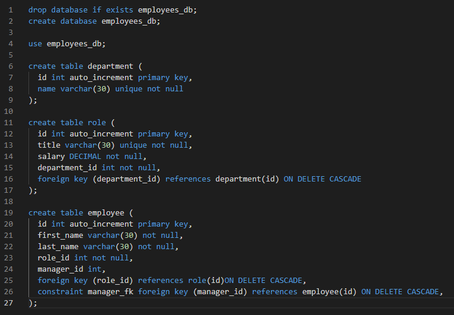
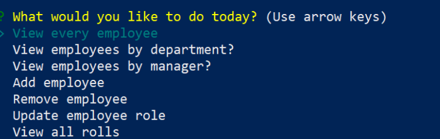

# EmployeeManagement


## Description

Employee Management System is a great way for you to use a CLI for tracking your employees and their managers. You can use this interface to add and remove employees as well as assign and change their roles.

## Table of Contents

- [Description](#description)
- [Installation](#installation)
- [Usage](#usage)
- [Contributing](#contributing)
- [Questions](#questions)

## Installation

1. Download repository

```
https://github.com/JosephCordell/EmployeeManagement.git
```

2. Install Dependencies

```
npm install
```

3. Run the schema.sql code in your database



4. (optional) run seed.sql code in your database for starter data

## Usage

[Video Walkthrough](https://youtu.be/q77KYkZ2jzo)

1. Run server.js

``` 
node server.js
```

2. Go through the options and choose one that pertains to what you want to do. 



## Contribution

#### Contributors

[Joseph Cordell](https://github.com/JosephCordell),

## Questions

If you have any questions or see any issues, please submit an [issue](https://github.com/JosephCordell/EmployeeManagement/issues) on GitHub!
